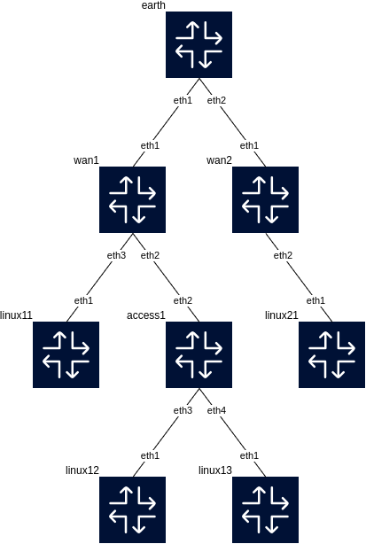

# Containerlab: SONiC-based WAN Edge

This repository demonstrates the implementation of a WAN edge using SONiC network operating system (NOS) running in containerlab. The goal is to showcase how SONiC can be used as a core routing and security device, effectively acting as a WAN controller and Layer 3 switch.

## Overview

This project simulates a multi-site network environment with two sites, each having a core SONiC switch (`wan1` and `wan2`) connected to an access switch (`access1` and `access2`). The core switches are responsible for:

* **WAN connectivity:**  Connecting to the internet through multiple interfaces:
    * Direct ISP connection
    * ZeroTier tunnel for site-to-site communication
    * Secure Web Gateway (SWG) tunnel for internet security
* **Inter-VLAN routing:** Routing traffic between VLANs within each site.
* **Firewalling:**  Implementing basic firewall rules and policy-based routing to direct traffic appropriately.
* **Layer 3 services:** Providing DHCP, DNS, and potentially other Layer 3 services (not implemented in this lab).

**Key Features**

* **SONiC as WAN edge:** Demonstrates the capabilities of SONiC as a versatile WAN edge device.
* **Multi-site connectivity:**  Simulates site-to-site connectivity using ZeroTier.
* **Secure Web Gateway integration:**  Includes a connection to a SWG for internet security.
* **Policy-based routing:** Implements policy-based routing to direct specific traffic (e.g., Microsoft Front Door) through different WAN interfaces.
* **Containerlab for network simulation:**  Utilizes containerlab for creating and managing the virtual network environment.

## Topology

The network topology consists of the following elements:

* **Core switches:** SONiC-based virtual switches (`wan1` and `wan2`) acting as the WAN edge devices for each site.
* **Access switches:** SONiC-based virtual switches (`access1` and `access2`) providing connectivity to end devices.
* **End devices:** Linux-based containers simulating clients and IoT devices.
* **WAN emulation:** A Linux container (`earth`) simulating the internet and providing connectivity to the WAN interfaces.

**[Network diagram]**

## Configuration

* **VLANs:** VLANs 1 (Guest), 10 (Office), 20 (Production), and 30 (IoT) are configured on all switches.
* **Ports:**
    * Core switches:
        * `Ethernet4`: Direct ISP connection (routed port)
        * `Ethernet6`: ZeroTier tunnel (routed port)
        * `Ethernet8`: SWG tunnel (routed port)
        * `Ethernet10`: Trunk port to access switch
    * Access switches:
        * `Ethernet4`: Trunk port to core switch
        * `Ethernet12`, `Ethernet14`, `Ethernet16`: Access ports for clients (VLANs 1, 10, 20)
        * `Ethernet24`, `Ethernet26`: Access ports for IoT devices (VLAN 30)
* **Routing:**
    * Default route via SWG tunnel.
    * Inter-VLAN routing using static routes or a dynamic routing protocol.
    * Policy-based routing to direct Microsoft Front Door traffic through the direct ISP connection.
    * Routes for the remote site's subnets via the ZeroTier tunnel.
* **ZeroTier:** ZeroTier is installed and configured on the core switches to establish the site-to-site connection.
* **SWG tunnel:** A tunnel is configured to connect to the chosen SWG provider.
* **Firewall rules:** Firewall rules are implemented to control traffic flow and enforce security policies.

## Running the Lab

1. **Clone the repository:** `git clone https://github.com/yonz2/containerlab.git`
2. **Deploy the lab:** `containerlab deploy -t sites.clab.yml`
3. **Access the devices:** Use `containerlab connect` or SSH to access the individual containers.
4. **Test the configuration:** Use ping, traceroute, and other tools to verify connectivity and traffic flow.

### Example deployment ###

| Name               | Kind/Image           | State  | Management IP |
| :-----------       | :------------        | :----  | :--------------  |
| **Mother Earth**   |          |         |                   |
| clab-sites-earth   | linux    | running | 172.20.20.14      |
|                    |          |         |                   |
| **Site 1**         |          |         |                   |
| clab-sites-wan1    | sonic-vs | running | 172.20.20.10      |
| clab-sites-access1 | sonic-vs  | running | 172.20.20.7       |
| clab-sites-linux11 | linux   | created | 172.20.20.9       |
| clab-sites-linux12 | linux   | running | 172.20.20.8       |
| clab-sites-linux13 | linux   | created | 172.20.20.12      |
|                    |          |         |                   |
| clab-sites-iot11   | linux    | running | 172.20.20.4       |
| clab-sites-iot12   | linux   | running | 172.20.20.5       |
|                    |          |         |                   |
| **Site 2**         |          |         |                   |
| clab-sites-wan2    | sonic-vs  | running | 172.20.20.2       |
| clab-sites-access2 | sonic-vs  | running | 172.20.20.3       |
|                    |          |         |                   |
| clab-sites-linux21 | linux   | running | 172.20.20.6       |
| clab-sites-linux22 | linux   | created | 172.20.20.9       |
| clab-sites-linux23 | linux  | running | 172.20.20.11      |
|                    |          |         |                   |
| clab-sites-iot21   | linux   | running | 172.20.20.9       |
| clab-sites-iot22   | linux   | running | 172.20.20.13      |

## Further Enhancements

* **Dynamic routing:** Implement a dynamic routing protocol (OSPF, BGP) for inter-VLAN and inter-site routing.
* **Advanced firewalling:**  Configure more complex firewall rules and security policies.
* **DHCP and DNS services:**  Configure DHCP and DNS services on the core switches.
* **Monitoring and management:** Integrate monitoring and management tools for the SONiC devices.

## Conclusion

This project demonstrates the potential of SONiC as a powerful and flexible WAN edge solution. By leveraging its capabilities and integrating with technologies like ZeroTier and SWG tunnels, you can create a robust and secure network infrastructure.

